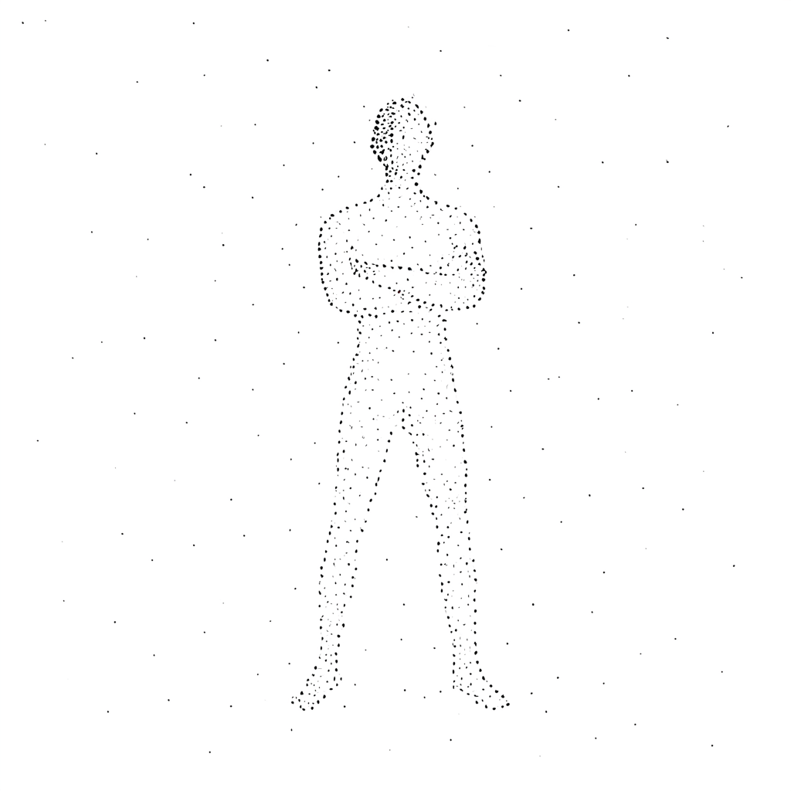

# prtkl — Particle Art Generator

Type a word, get a particle art figure. Abstract anthropomorphic forms made of sparse black dots on white backgrounds.

<p align="center">
  
</p>

## What This Is

A fine-tuned SDXL LoRA that generates particle art — human figures composed of scattered black flecks suggesting form through negative space. Not pointillism, not stippling — something more abstract and minimal.

The model was trained on ~50 curated images using LoRA + Textual Inversion (pivotal tuning) on Modal's A10G GPUs. The trigger tokens `<s0><s1>` activate the particle art style.

For a detailed writeup on the training process, iteration history, and lessons learned, see the [blog post](https://awill.co/writing/fine%20tuning%20stable%20diffusion%20to%20create%20particle%20art/).

## Quick Start

### Generate via API

The model is deployed as a serverless endpoint on Modal. Send a POST request, get a PNG back:

```bash
curl -X POST https://youfoundaaron--prtkl-generate-model-generate.modal.run \
  -H "Content-Type: application/json" \
  -d '{"prompt": "<s0><s1>, a figure with arms raised, white background"}' \
  --output particle_art.png
```

**Request body:**

| Field | Default | Description |
|-------|---------|-------------|
| `prompt` | required | Must start with `<s0><s1>,` |
| `negative_prompt` | sensible default | Steers away from photorealism |
| `num_inference_steps` | 30 | Max 50 |
| `guidance_scale` | 5.0 | |
| `seed` | random | For reproducibility |
| `width` | 1024 | |
| `height` | 1024 | |

First request takes ~30-60s (cold start). Subsequent requests ~10s.

### Use the Weights Directly

The LoRA weights are on HuggingFace: [aaronw122/prtkl-sdxl-lora](https://huggingface.co/aaronw122/prtkl-sdxl-lora)

```python
import torch
from diffusers import AutoencoderKL, DiffusionPipeline
from safetensors.torch import load_file
from huggingface_hub import hf_hub_download

vae = AutoencoderKL.from_pretrained("madebyollin/sdxl-vae-fp16-fix", torch_dtype=torch.float16)
pipe = DiffusionPipeline.from_pretrained(
    "stabilityai/stable-diffusion-xl-base-1.0",
    vae=vae, torch_dtype=torch.float16, variant="fp16",
).to("cuda")

pipe.load_lora_weights("aaronw122/prtkl-sdxl-lora", weight_name="pytorch_lora_weights.safetensors")

ti_path = hf_hub_download("aaronw122/prtkl-sdxl-lora", "results_emb.safetensors")
state_dict = load_file(ti_path)
pipe.load_textual_inversion(state_dict["clip_l"], token=["<s0>", "<s1>"], text_encoder=pipe.text_encoder, tokenizer=pipe.tokenizer)
pipe.load_textual_inversion(state_dict["clip_g"], token=["<s0>", "<s1>"], text_encoder=pipe.text_encoder_2, tokenizer=pipe.tokenizer_2)

image = pipe(
    "<s0><s1>, a figure dancing with arms raised, white background",
    negative_prompt="photorealistic, detailed, shading, gradient, gray, color, dense",
    num_inference_steps=30, guidance_scale=5.0,
).images[0]
image.save("output.png")
```

### Run Locally

```bash
git clone https://github.com/aaronw122/particleArt
cd particleArt
uv sync
uv run python serve_local.py --device cuda        # NVIDIA GPU
uv run python serve_local.py --device mps          # Apple Silicon
```

## Prompt Tips

- Always prefix with `<s0><s1>,`
- Single figures work best (the model was trained primarily on single-figure compositions)
- Describe body posture and gesture, not fine details ("arms raised" not "holding a flower")
- Add "white background" for cleanest results
- Works well: balancing, leaping, lunging, meditating, arching, crawling, standing poses

## Project Structure

```
inference/          Shared inference pipeline (device-agnostic)
serve_modal.py      Modal serverless endpoint
serve_local.py      Local FastAPI server
train_modal_adamw.py    Training script (AdamW on Modal)
generate_modal*.py      Generation/sweep scripts
postprocess.py          Background cleanup utilities
plan.md                 Project architecture and roadmap
```

## Training Details

- **Base model:** SDXL 1.0
- **Method:** LoRA (rank 32) + Textual Inversion (pivotal tuning)
- **Optimizer:** AdamW 8-bit, LR 9e-5 (UNet), 2.5e-4 (text encoder)
- **Best checkpoint:** Step 1800
- **Compute:** Modal A10G (24GB VRAM)
- **Training data:** ~50 curated images, each with scene description captions

See `CLAUDE.md` for full training configuration and design principles.

## License

Apache 2.0
